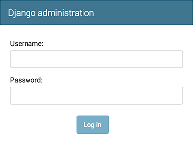

# 创建你的第一个 Django 项目， 第二部分

这一篇从 [第一部分（zh）](part1.md)结尾的地方继续讲起。本节我们将建立数据库，创建你的第一个模型，然后是快速介绍一下 Django 自动生成的管理站点。

## 数据库的建立

现在，打开 **mysite/settings.py**，这是个普通的 Python 模块，用模块级别的变量表示 Django 设置。

默认情况下，配置的数据库是 SQLite，如果你对数据库不太熟，或者你只是对尝试 Django 感兴趣，这是最简单的选择。SQLite 内嵌在 Python 里，所以你不用再安装其他东西来支持你的数据库。但是当你开始做第一个实际的项目时，你也许想使用一个可扩展的数据库，比如 PostgreSQL 来避免令人头痛地切换数据库问题。

如果你希望使用其他数据库，你需要安装合适的 [database bingings](https://docs.djangoproject.com/en/1.11/topics/install/#database-installation) 和在 [DATABASES](https://docs.djangoproject.com/en/1.11/ref/settings/#std:setting-DATABASES) 'default' 默认项里改变一些键值，以匹配你的数据库设置：
- [**引擎（ENGINE）**](https://docs.djangoproject.com/en/1.11/ref/settings/#std:setting-DATABASE-ENGINE) - **'django.db.backends.sqlite3'**,
	**'django.db.backends.postgresql'**,
	**'django.db.backends.mysql'**, 或者
	**'django.db.backends.oracle'**。 其他的后端 [也可以参考](https://docs.djangoproject.com/en/1.11/ref/databases/#third-party-notes)。
- [**名字（NAME）**](https://docs.djangoproject.com/en/1.11/ref/settings/#std:setting-NAME) - 你数据库的名字。如果你正在使用 SQLite，数据库将以文件形式保存在你的电脑；在这种情况下，[**名字**](https://docs.djangoproject.com/en/1.11/ref/settings/#std:setting-NAME) 应该是绝对路径，包括文件名。默认 **os.path.join(BASE_DIR, 'db.sqlite3')** 将把文件保存在你项目的目录下。

如果你不使用 SQLite 作为你的数据库，那就必须额外设置下比如 [**USER**](https://docs.djangoproject.com/en/1.11/ref/settings/#std:setting-USER)， [**PASSWORD**](https://docs.djangoproject.com/en/1.11/ref/settings/#std:setting-PASSWORD) 和  [**HOST**](https://docs.djangoproject.com/en/1.11/ref/settings/#std:setting-HOST)。若想查看更多详情，可以参考文档 [**DATABASES**](https://docs.djangoproject.com/en/1.11/ref/settings/#std:setting-DATABASES)。

> 对于 SQLite 以外的数据库
>
> 如果你使用除 SQLite 以外的数据库，请确认你已经创建了数据库。在你的数据库交互提示里用 “CREATE DATABASE database_name;” 创建数据库。
>
> 同样要确认在 **mysite/settings.py** 中的数据库用户拥有创建数据库的权限。这可以允许自动创建 [测速数据库](https://docs.djangoproject.com/en/1.11/topics/testing/overview/#the-test-database) —— 后面的教程需要。
>
> 如果你在使用 SQLite，你不需要在这之前创建什么 —— 数据库文件会在需要的时候自动创建。

当你编辑 **mysite/settings** 的时候，记得把时区 [**TIME_ZONE**](https://docs.djangoproject.com/en/1.11/ref/settings/#std:setting-TIME_ZONE) 设成你要的时区。

同样的，注意 [**INSTALLED_APPS**](https://docs.djangoproject.com/en/1.11/ref/settings/#std:setting-INSTALLED_APPS) 应该设置在文件的较顶端处。它放着这个 Django 实例激活的所有 Django 应用程序。应用可以被用在多个项目中，你可以把它们打包分发，供其他人在项目中使用。

默认情况下，[**INSTALLED_APPS**](https://docs.djangoproject.com/en/1.11/ref/settings/#std:setting-INSTALLED_APPS) 包含着下面这些应用，它们都来自 Django：

- [**django.contrib.admin**](https://docs.djangoproject.com/en/1.11/ref/contrib/admin/#module-django.contrib.admin) —— 管理站点。你可以快捷地使用它。
- [**django.contrib.auth**](https://docs.djangoproject.com/en/1.11/topics/auth/#module-django.contrib.auth) —— 认证系统。
- [**django.contrib.contenttypes**](https://docs.djangoproject.com/en/1.11/ref/contrib/contenttypes/#module-django.contrib.contenttypes) —— 内容类型框架。
- [**django.contrib.sessions**](https://docs.djangoproject.com/en/1.11/topics/http/sessions/#module-django.contrib.sessions) —— session 框架。
- [**django.contrib.messages**](https://docs.djangoproject.com/en/1.11/ref/contrib/messages/#module-django.contrib.messages) —— 消息框架。
- [**django.contrib.staticfiles**](https://docs.djangoproject.com/en/1.11/ref/contrib/staticfiles/#module-django.contrib.staticfiles) —— 静态文件管理框架。

通常情况下为了方便，这些应用默认已被包含。

其中一些应用使用了至少一张数据库表，所以在使用它们之前，我们需要先在数据库中创建这些表。可以运行这行命令做些事：

```bash
$ python manage.py migrate
```

[**migrate**](https://docs.djangoproject.com/en/1.11/ref/django-admin/#django-admin-migrate) 命令在 **mysite/settings.py** 文件的 [**INSTALLED_APPS**](https://docs.djangoproject.com/en/1.11/ref/settings/#std:setting-INSTALLED_APPS) 设置中寻找，并根据数据库设置创建一些必要的数据库表和随应用迁移的数据库（我们将会稍后介绍）。你将看到应用于各个迁移的消息。如果你感兴趣，可以运行一下你的数据库客户端，然后输入（**\dt** (PostgreSQL), **SHOW TABLES;** (MySQL), **.schema** (SQLite), **SELECT TABLE_NAME FROM USER_TABLES;** (Oracle)）来看下 Django 创建的这些表。

> **给极简主义者**
>
> 就像我们上面说的，通常情况下，这些默认应用都被包含了，但不是人人都需要它们的。如果你不需要其中一些，或者不需要它们全部，在运行 [**migrate**](https://docs.djangoproject.com/en/1.11/ref/django-admin/#django-admin-migrate) 之前，可以随心把它们从 [**INSTALLED_APPS**](https://docs.djangoproject.com/en/1.11/ref/settings/#std:setting-INSTALLED_APPS) 中注释或删掉。[**migrate**](https://docs.djangoproject.com/en/1.11/ref/django-admin/#django-admin-migrate) 命令只会迁移那些在 [**INSTALLED_APPS**](https://docs.djangoproject.com/en/1.11/ref/settings/#std:setting-INSTALLED_APPS) 中激活的应用的数据库。

## 创建模型

现在我们将用额外的元数据来定义你的模型 —— 本质上是你的数据库布局。

> **设计哲学**
>
> 模型是你数据的简单明确的描述。它包含了储存的数据所必要的字段和行为。Django 遵循 [DRY 原则](https://docs.djangoproject.com/en/1.11/misc/design-philosophies/#dry)。它的目标是让你只需要在一个地方定义数据模型，Django 就能自动从中导出迁移代码。
>
> 来介绍一下迁移 - 举个例子，不像 Ruby On Rails，Django 的迁移代码全部都是从你的模型文件导出的，它本质上只是个历史记录，Django 可以通过滚动更新数据库来匹配你当前的模型。

在这个简单的投票应用中，我们将创建两个模型：问题 **Question** 和选项 **Choice**。**Question** 模型包括问题描述和发布时间。**Choice** 模型有两个字段：选项描述和当前票数。每个 **选项** 属于一个 **问题**。

这些概念可以通过一个简单的 Python 类来表示。像下面那样编辑 **polls/models.py** 文件：

```python3
# polls/models.py

from django.db import models

class Question(models.Model):
    question_text = models.CharField(max_length=200)
    pub_date = models.DateTimeField('date published')

class Choice(models.Model):
    question = models.ForeignKey(Question, on_delete=models.CASCADE)
    choice_text = models.CharField(max_length=200)
    votes = models.IntegerField(default=0)
```

代码非常直白。每个模型都被表示为 [**django.db.models.Model**](https://docs.djangoproject.com/en/1.11/ref/models/instances/#django.db.models.Model) 类的子类。每个模型都有些类变量，每一个都表示为模型里的一个数据库字段。

每个字段都是 [**Field**](https://docs.djangoproject.com/en/1.11/ref/models/fields/#django.db.models.Field) 类的实例 - 比如，字符字段被表示为 [**CharField**](https://docs.djangoproject.com/en/1.11/ref/models/fields/#django.db.models.CharField)，日期时间字段被表示为 [**DateTimeField**](https://docs.djangoproject.com/en/1.11/ref/models/fields/#django.db.models.DateTimeField)。这告诉 Django 每个要处理的字段是什么数据类型。

每个 [**Field**](https://docs.djangoproject.com/en/1.11/ref/models/fields/#django.db.models.Field) 类实例变量的名字（比如 **question_text** 或 **pub_date**）都是字段名，这是对机器友好的格式。你将会在 Python 代码里使用它们，而数据库会将它们作为列名。

你可以使用可选的选项来为 [**Field**](https://docs.djangoproject.com/en/1.11/ref/models/fields/#django.db.models.Field) 定义一个人类可读的名字。这个功能在很多 Django 内部组成部分中都被使用了，而且作为文档的一部分。如果某个字段没有被提供，Django 将会使用对机器友好的名称（也就是变量名）。在上面的例子中，我们只为 **Question.pub_date** 定义了对人类可读的名字。对于模型内的其他字段，它们的机器可读名也会被作为人类可读名使用。

定义某些 [**Field**](https://docs.djangoproject.com/en/1.11/ref/models/fields/#django.db.models.Field) 类实例需要参数。例如 [**CharField**](https://docs.djangoproject.com/en/1.11/ref/models/fields/#django.db.models.CharField) 需要参数 [**max_length**](https://docs.djangoproject.com/en/1.11/ref/models/fields/#django.db.models.CharField.max_length)。该参数不止用于定义数据库结构，也用于验证数据，我们稍后将会看到这方面的内容。

[**Field**](https://docs.djangoproject.com/en/1.11/ref/models/fields/#django.db.models.Field) 能够接收多个可选参数；在上面的例子中：我们已经将 **votes** 的 [**default**](https://docs.djangoproject.com/en/1.11/ref/models/fields/#django.db.models.Field.default) 默认值设为0。

最后，还要注意到我们使用了 [**ForeignKey**](https://docs.djangoproject.com/en/1.11/ref/models/fields/#django.db.models.ForeignKey) 外键来定义一个关系。这会告诉 Django 每个 **Choice** 对象都和一个 **Question** 对象相关联。Django 支持所有常用的数据库关系：多对一、多对多和一对一。

## 激活模型

上面的一小段用于创建模型的代码给了 Django 很多信息，通过这些信息，Django 可以：

- 为这个应用创建数据库结构（生成 **CREATE TABLE** 语句）。
- 创建可以与 **Question** 和 **Choice** 对象进行交互的 Python 数据库 API。

但是我们首先要告诉项目 **polls** 应用要被安装进来。

> **设计哲学**
>
> Django 应用是“可插拔”的。你可以在多个项目中使用同一个应用。除此之外，你还可以分发自己的应用，因为它们并不会被绑定到当前安装的 Django 上。

要在项目中包含应用，我们需要在 **INSTALLED_APPS** 设置里添加这个应用的设置类。这个设置类 **PollsConfig** 在 **polls/apps.py** 文件里，它的点分路径是 **'polls.apps.PollsConfig'**。编辑 **mysite/settings.py**，然后在 **INSTALLED_APPS** 设置里添加这个点分路径，使其包含字符串 **polls**。看起来应该像这样：

```python3
# mysite/settings.py
INSTALLED_APPS = [
    'polls.apps.PollsConfig',
    'django.contrib.admin',
    'django.contrib.auth',
    'django.contrib.contenttypes',
    'django.contrib.sessions',
    'django.contrib.messages',
    'django.contrib.staticfiles',
]
```

现在 Django 项目知道了要包含 **polls** 应用。接着运行下面的命令

```bash
$ python manage.py makemigrations polls
```

你将会看到类似于下面的输出：

```text
Migrations for 'polls':
  polls/migrations/0001_initial.py:
    - Create model Choice
    - Create model Question
    - Add field question to choice
```

通过运行 **makemigrations** 命令，你告诉了 Django 你对模型文件做了些修改（在上面例子，你创建了新的模型），修改的部分被储存为了一次 *迁移*。

迁移是 Django 对于模型（也就是你的数据库结构）的修改的储存形式 - 它们其实也只是一些磁盘上的文件。如果你想的话，你可以阅读一下你模型的迁移数据，它被储存在 **polls/migrations/0001_initial.py** 里。别担心，你不需要每次都阅读迁移文件，但是它们被设计成人类可编辑的形式，这是为了你能手动对它们进行微调。

Django 有一个自动执行数据库迁移并同步管理你的数据库结构的命令 - 这个命令是 [**migrate**](https://docs.djangoproject.com/en/1.11/ref/django-admin/#django-admin-migrate)，我们马上就会接触它 - 但是首先，让我们看看迁移命令会执行哪些 SQL 语句。[**sqlmigrate**](https://docs.djangoproject.com/en/1.11/ref/django-admin/#django-admin-sqlmigrate) 命令接收一个迁移的名称，然后返回对应的 SQL：

```bash
$ python manage.py sqlmigrate polls 0001
```

你应该会看到类似下面这样的输出（我们已经把输出重组成了可读的格式）：

```text
BEGIN;
--
-- 创建 Choice 模型
--
CREATE TABLE "polls_choice" (
    "id" serial NOT NULL PRIMARY KEY,
    "choice_text" varchar(200) NOT NULL,
    "votes" integer NOT NULL
);
--
-- 创建 Question 模型
--
CREATE TABLE "polls_question" (
    "id" serial NOT NULL PRIMARY KEY,
    "question_text" varchar(200) NOT NULL,
    "pub_date" timestamp with time zone NOT NULL
);
--
-- 对 choice 表添加 question 字段
--
ALTER TABLE "polls_choice" ADD COLUMN "question_id" integer NOT NULL;
ALTER TABLE "polls_choice" ALTER COLUMN "question_id" DROP DEFAULT;
CREATE INDEX "polls_choice_7aa0f6ee" ON "polls_choice" ("question_id");
ALTER TABLE "polls_choice"
  ADD CONSTRAINT "polls_choice_question_id_246c99a640fbbd72_fk_polls_question_id"
    FOREIGN KEY ("question_id")
    REFERENCES "polls_question" ("id")
    DEFERRABLE INITIALLY DEFERRED;

COMMIT;
```

请注意以下几点：

- 输出的内容和你使用的数据库有关，上面的输出示例使用的是 PostgreSQL。
- 数据库的表名是由应用名（**polls**）和模型名的小写形式（**question** 和 **choice**）连接而来。（如果需要，你可以自定义此行为。）
- 主键（ID）会被自动添加。（当然，你也可以自定义。）
- 惯例下，Django 会在外键字段名后追加字符串 **“\_id”**。（同样，这也可以自定义。）
- 外键关系由 **FOREIGN KEY** 生成。别担心 **DEFERRABLE** 部分，它只是告诉 PostgreSQL，请在事务全都执行完之后再创建外键关系。
- 生成的 SQL 语句是为你所用的数据库定制的，所以那些和数据库有关的字段类型，比如 **auto_increment**（MySQL）、**serial**（PostgreSQL）和 **integer primary key autoincrement**（SQLite），都会为你自动处理的。那些和引号相关的事情 - 例如，是使用单引号还是双引号 - 也一样会被自动处理。
- [**sqlmigrate**](https://docs.djangoproject.com/en/1.11/ref/django-admin/#django-admin-sqlmigrate) 命令并没有真正在你的数据库中的执行迁移 - 它只是把命令输出到屏幕上，让你看看 Django 认为需要执行哪些 SQL 语句。这在你想看看 Django 到底准备做什么，或者当你是数据库管理员，需要写脚本来批量处理数据库时会很有用。

如果你感兴趣，你也可以尝试运行 [**python manage.py check**](https://docs.djangoproject.com/en/1.11/ref/django-admin/#django-admin-check)；这个命令帮助你检查项目中的问题，并且在检查过程中不会对数据库进行任何操作。

现在，再次运行 [**migrate**](https://docs.djangoproject.com/en/1.11/ref/django-admin/#django-admin-migrate) 命令，在数据库里创建模型的数据表：

```text
$ python manage.py migrate
Operations to perform:
  Apply all migrations: admin, auth, contenttypes, polls, sessions
Running migrations:
  Rendering model states... DONE
  Applying polls.0001_initial... OK
```

[**migrate**](https://docs.djangoproject.com/en/1.11/ref/django-admin/#django-admin-migrate) 命令选中所有还没有执行过的迁移（Django 通过在数据库中创建一个特殊的表 **django_migrations** 来跟踪执行过哪些迁移）并应用在数据库上 - 也就是将你对模型的更改同步到数据库结构上。

迁移是非常强大的功能，它能让你在开发过程中持续的改变数据库结构而不需要重新删除和创建表 - 它专注于使数据库平滑升级而不会丢失数据。我们会在后面的教程中更加深入的学习这部分内容，现在，你只需要记住，改变模型需要这三步：

- 编辑 **models.py** 文件，改变模型。
- 运行 **python manage.py makemigrations** 为模型的改变生成迁移文件。
- 运行 **python manage.py migrate** 来应用数据库迁移。

数据库迁移被分解成生成和应用两个命令是为了让你能够在代码控制系统上提交迁移数据并使其能在多个应用里使用；这不仅仅会让开发更加简单，也给别的开发者和生产环境中的使用带来方便。

通过阅读文档 [Django-admin documentation](https://docs.djangoproject.com/en/1.11/ref/django-admin/)，你可以获得关于 **manage.py** 工具的更多信息。

## 初试 API

现在让我们进入交互式 Python 命令行，尝试一下 Django 为你创建的各种 API。通过以下命令打开 Python 命令行：

```bash
$ python manage.py shell
```

我们使用这个命令而不是简单的使用 “Python” 是因为 **manage.py** 会设置 **DJANGO_SETTINGS_MODULE** 环境变量，这个变量会让 Django 根据 **mysite/settings.py** 文件来设置 Python 包的导入路径。

> **我就是不想用 manage.py**
>
> 如果你不想使用 **manage.py** ，没问题，你只要手动将 [**DJANGO_SETTINGS_MODULE**](https://docs.djangoproject.com/en/1.11/topics/settings/#envvar-DJANGO_SETTINGS_MODULE) 环境变量设置为 **mysite.settings** 就行。打开一个普通的 Python 命令行，然后输入以下命令来配置 Django：
>
```pycon
>>> import django
>>> django.setup()
```
>
> 如果抛出 [**AttributeError**](https://docs.python.org/3/library/exceptions.html#AttributeError) 错误，说明你使用的 Django 版本可能和本教程不一致。你可以切换到旧版本的教程或者把 Django 升级至最新版本。
>
> 你必须在 **manage.py** 所在目录中运行 **python** 命令，或者确保这个目录在 Python path 里，因为只有这样 import mysite 才能被正确的执行。
>
> 阅读文档 [Django-admin documentation](https://docs.djangoproject.com/en/1.11/ref/django-admin/) 获取更多信息。

当你成功进入命令行后，来试试 [数据库 API](https://docs.djangoproject.com/en/1.11/topics/db/queries/) 吧：

```pycon
>>> from polls.models import Question, Choice   # 导入刚刚创建的模型类

# 现在系统里还没有 Question 对象
>>> Question.objects.all()
<QuerySet []>

# 创建新 Question
# 在 settings 文件里，时区支持被设为开启状态，所以
# pub_date 字段要求一个带有时区信息（tzinfo）
# 的 datetime 数据。请使用 timezone.now() 代替
# datetime.datetime.now()，这样就能获取正确的时间。
>>> from django.utils import timezone
>>> q = Question(question_text="What's new?", pub_date=timezone.now())

# 想将对象保存到数据库中，必须显式的调用 save()。
>>> q.save()

# 现在它被分配了一个 ID。注意有可能你的结果是“1L”而不是“1”，
# 这取决于你在使用哪种数据库。这不是什么大问题；只是表明
# 你所用的数据库后端倾向于将整数转换为 Python 的
# long integer 对象。
>>> q.id
1

# 通过属性来获取模型字段的值
>>> q.question_text
"What's new?"
>>> q.pub_date
datetime.datetime(2012, 2, 26, 13, 0, 0, 775217, tzinfo=<UTC>)

# 通过改变属性值来改变模型字段，然后调用 save()。
>>> q.question_text = "What's up"
>>> q.save()

# objects.all() 显示数据库中所有 question。
>>> Question.objects.all()
<QuerySet [<Question: Question object>]>
```

等等。用 \<Question: Question object\> 表示这个对象没什么帮助信息，它无法告诉我们这个对象的详细信息。让我们通过编辑 **Question** 模型的代码（**polls/models.py** 文件），给 **Question** 和 **Choice** 增加 **\_\_str\_\_()** 方法来改善这个问题：

```python3
# polls/models.py
from django.db import models
from django.utils.encoding import python_2_unicode_compatible、

@python_2_unicode_compatible  # 如果你想支持 Python 2
class Question(models.Model):
    # ...
    def __str__(self):
        return self.question_text

@python_2_unicode_compatible  # 如果你想支持 Python 2
class Choice(models.Model):
    # ...
    def __str__(self):
        return self.choice_text
```

给模型增加 **\_\_str\_\_()** 方法是很重要的，这不仅仅能给你在交互式的命令行里使用带来方便，而且 Django 自动生成的 admin 里也是使用这个方法来表示对象的。

注意这些只是 Python 的普通方法。我们可以向模型里添加自定义方法，示范：

```python3
# polls/models.py

import datetime

from django.db import models
from django.utils import timezone

class Question(models.Model):
    # ...
    def was_published_recently(self):
        return self.pub_date >= timezone.now() - datetime.timedelta(days=1)
```

注意，新加入的 **import datetime** 和 **from django.utils import timezone** 分别导入了 Python 的标准 [**datetime**](https://docs.python.org/3/library/datetime.html#module-datetime) 模块和 Django 中和时区相关的 [**django.utils.timezone**](https://docs.djangoproject.com/en/1.11/ref/utils/#module-django.utils.timezone) 工具模块。如果你不太熟悉 Python 中的时区处理，可以看看 [time zone support docs](https://docs.djangoproject.com/en/1.11/topics/i18n/timezones/)。

保存文件然后通过 **python manage.py shell** 命令再次打开 Python 交互式命令行：

```pycon
>>> from polls.models import Question, Choice

# 确认添加的 __str__() 是否正常工作。
>>> Question.objects.all()
<QuerySet [<Question: What's up?>]>

# Django 提供了丰富的数据库查找 API，
# 通过关键字参数就能轻松使用。
>>> Question.objects.filter(id=1)
<QuerySet [<Question: What's up?>]>
>>> Question.objects.filter(question_text__startswith='What')
<QuerySet [<Question: What's up?>]>

# 获取今年发布的问题
>>> from django.utils import timezone
>>> current_year = timezone.now().year
>>> Question.objects.get(pub_date__year=current_year)
<Question: What's up?>

# 查找一个不存在的 ID 将会引发异常
>>> Question.objects.get(id=2)
Traceback (most recent call last):
    ...
DoesNotExist: Question matching query does not exist.

# 通过主键来查找数据是非常常见的需求，所以 Django
# 为这种需求专门制定了一个参数。
# 以下代码等同于 Question.objects.get(id=1)。
>>> Question.objects.get(pk=1)
<Question: What's up?>

# 确认我们自定义的方法正常工作。
>>> q = Question.objects.get(pk=1)
>>> q.was_published_recently()
True

# 给这个问题添加几个选项。create 函数会创建一个新的
# Choice 对象，执行 INSERT 语句，将 Choice 添加到
# Question 的选项列表中，最后返回刚刚创建的
# Choice 对象。Django 创建了一个集合 API 来使你可以从
# 外键关系的另一方管理关联的数据。
# （例如，可以获取问题的选项列表）
>>> q = Question.objects.get(pk=1)

# 显示所有和当前问题关联的选项列表，现在是空的。
>>> q.choice_set.all()
<QuerySet []>

# 创建三个选项。
>>> q.choice_set.create(choice_text='Not much', votes=0)
<Choice: Not much>
>>> q.choice_set.create(choice_text='The sky', votes=0)
<Choice: The sky>
>>> c = q.choice_set.create(choice_text='Just hacking again', votes=0)

# Choice 对象能通过 API 获取关联到的 Question 对象。
>>> c.question
<Question: What's up?>

# 反过来，Question 对象也可以获取 Choice 对象
>>> q.choice_set.all()
[<Choice: Not much>, <Choice: The sky>, <Choice: Just hacking again>]
>>> q.choice_set.count()
3

# 查找 API 的关键字参数可以自动调用关系函数。
# 只需使用双下划线来分隔关系函数。
# 只要你想，这个调用链可以无限长。
# 例如查找所有「所在问题的发布日期是今年」的选项
# （重用我们之前创建的 'current_year' 变量）
>>> Choice.objects.filter(question__pub_date__year=current_year)
[<Choice: Not much>, <Choice: The sky>, <Choice: Just hacking again>]

# 试试删除一个选项，使用 delete() 函数。
>>> c = q.choice_set.filter(choice_text__startswith='Just hacking')
>>> c.delete()
```

阅读 [Accessing related objects](https://docs.djangoproject.com/en/1.11/ref/models/relations/) 文档可以获取关于数据库关系的更多内容。想知道关于双下划线的更多用法，参见 [Field Lookup](https://docs.djangoproject.com/en/1.11/topics/db/queries/#field-lookups-intro) 文档。数据库 API 的所有细节可以在 [Database API reference](https://docs.djangoproject.com/en/1.11/topics/db/queries/) 文档中找到。

## 介绍下 Django 的管理站点

> **设计哲学**
>
> 为你的团队和客户创建一个用于添加、修改和删除网站内容的管理页面是一项乏味的工作，而且不需要太多的创造力。因为这些原因，Django 提供完全自动地为模型创建管理接口的功能。
>
> Django 产生于一个公众页面和内容发布者页面完全分离的新闻类站点的开发过程中。站点管理人员使用管理系统来添加新闻、事件和体育时讯等，这些添加的内容被显示在公众页面上。Django 通过为站点管理人员创建统一的内容编辑界面解决了这个问题。
>
> 管理界面不是为了网站的访问者，而是为管理者准备的。

## 创建管理员账户

首先，我们得创建一个能登录管理页面的用户。请运行下面的命令：

```bash
$ python manage.py createsuperuser
```

输入你想使用的用户名，然后回车。

```
Username: admin
```

接着，你会被提示要求输入邮箱：

```
Email address: admin@example.com
```

最后一步是输入密码。你会被要求输入两次密码，第二次的目的是为了确认第一次输入的确实是你想要的密码。

```
Password: ********
Password(again): ********
Superuser created successfully.
```

## 启动用于开发的服务器

Django 的管理界面默认就是启用的。让我们启动开发服务器，看看它到底是什么样的。

如果服务器还没运行，那就运行下：

```bash
$ python manage.py runserver
```

现在，打开浏览器，转到你本地域名的 “/admin/” 目录，比如 “http://127.0.0.1:8000/admin” 。你应该会看见管理员登录界面：



因为[翻译](https://docs.djangoproject.com/en/1.11/topics/i18n/translation/)功能默认是开着的，所以登录界面可能会使用你的语言，取决于你的浏览器设置和是否 Django 已被翻译成你的语言。

## 进入管理页面

现在，试着使用你在上一步中创建的超级用户来登录。然后你将会看到 Django 管理页面的索引页：


你将会看到几种可编辑的内容：组和用户。它们由 [**django.contrib.auth**](https://docs.djangoproject.com/en/1.11/topics/auth/#module-django.contrib.auth) 提供，这是 Django 开发的认证框架。

## 向管理页面中加入投票应用

但是我们的投票应用在哪呢？它没在索引页面里显示。

只需要做一件事：我们得告诉管理页面，**Question** 对象需要被管理。打开 **polls/admin.py** 文件，把它编辑成下面这样：

```python3
# polls/admin.py

from django.contrib import admin

from .models import Question

admin.site.register(Question)
```

## 体验便捷的管理功能

现在我们向管理页面注册了 **Question** 类。Django 知道它应该被显示在索引页里：


点击 “Question”。现在看到是 Question 对象的修改列表。这个界面会显示所有数据库里的 Question 对象，你可以选择一个来修改。这里现在有我们在上一部分中创建的 “What's up?” 问题。


点击 “What's up?” 来编辑这个 Question 对象：


有些事情需要注意：

- 这个表单是从 **Question** 模型中自动生成的。
- 不同的字段类型 **日期时间字段（DateTimeField）**、**字符字段（CharField）** 会生成对应的 HTML 输入控件。每个类型的字段都知道它们该如何在管理页面里显示自己。
- 每个 **日期时间字段（DateTimeField）** 都有 JavaScript 写的快捷按钮。日期有转到今天（Today）的快捷按钮和一个弹出式日历界面。时间有设为现在（Now）的快捷按钮和一个列出常用时间的方便的弹出式列表。

页面的底部提供了几个选项：

- 保存（Save） - 保存改变，然后返回对象列表。
- 保存并继续编辑（Save and continue editing） - 保存改变，然后重新载入当前对象的修改界面。
- 保存并新增（Save and add another） - 保存改变，然后添加一个新的空对象并载入修改界面。
- 删除（Delete） - 显示一个确认删除页面。

如果显示的“发布日期（Date Published）”和你在教程第一部分里创建它们的时间不一致，这意味着你可能没有正确的设置 [**TIME_ZONE**](https://docs.djangoproject.com/en/1.11/intro/tutorial01/)。改变设置，然后重新载入页面看看是否显示了正确的值。

通过点击“今天”（Today）和“现在（Now）”按钮改变“发布日期（Date Published）”。然后点击“保存并继续编辑（Save and add another）”按钮。然后点击右上角的“历史（History）”按钮。你会看到一个列出了所有通过 Django 管理页面对当前对象进行的改变的页面，其中列出了时间戳和进行修改操作的用户名：


当你明白了模型的 API 和熟悉了你自己的管理站点后，你就可以开始阅读 [教程的第三部分（zh）](part3.md) ，学习如何在投票应用中添加更多的视图。