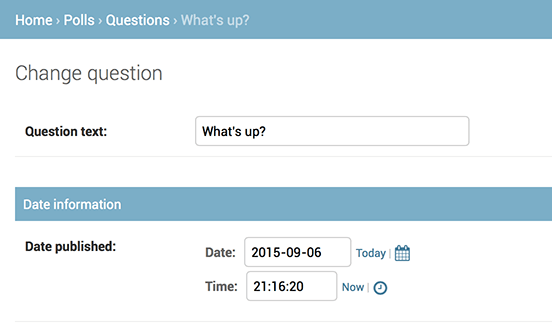
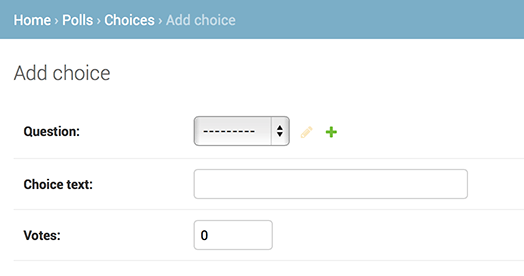
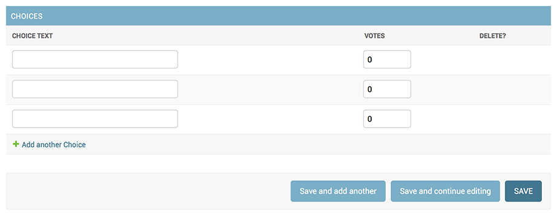

# 创建你的第一个 Django 项目， 第六部分

这一篇从 [第六部分（zh）](part6.md)结尾的地方继续讲起。我们继续在投票程序上下功夫，本章着力于自定义 Django 自动生成的管理站点（在 [第二章（zh）](part2.md)已有涉及）。

## 自定义管理表单

通过使用 **admin.site.register(Question)** 注册 **问题（Question）**模型，Django 能构造一个出一个默认的表单样式。通常，你会想自定义表单的样式和作用。你能通过在注册对象时增加一些选项来达到这一目的。

来看看如何改变表单中字段的顺序。把 **admin.site.register(Question)** 替换成下面的代码：

```python3
# polls/admin.py

from django.contrib import admin

from .models import Question


class QuestionAdmin(admin.ModelAdmin):
    fields = ['pub_date', 'question_text']

admin.site.register(Question, QuestionAdmin)
```

当你想改变管理页面的某些选项时，步骤一般是这样的：创建模型管理对象（model admin object），然后把它当作第二个参数传递给 **admin.site.register()** 函数。

上面的代码会使“发布日期（Publication date）”出现在“问题说明（Question text）”字段之前。


如果只有两个字段的话感觉不出什么，但是当表单有十几个字段时，选择一个直观的顺序是个可以提升用户体验细节。

如果真的有十几个字段的话，你可能想将它们分组，也即分为多个字段集（fieldsets）：

```python3
# polls/admin.py

from django.contrib import admin

from .models import Question


class QuestionAdmin(admin.ModelAdmin):
    fieldsets = [
        (None,               {'fields': ['question_text']}),
        ('Date information', {'fields': ['pub_date']}),
    ]

admin.site.register(Question, QuestionAdmin)
```

[**fieldsets**][fieldsets] 列表里的元组的第一个元素是分组名。下面是表单现在的样子：



## 添加关联对象

现在我们已经可以管理问题（Question）了。但是每个 **问题（Question）**都有多个 **选项（Choices）**，而且管理页面里并没有选项。

不过马上就有了。

有两个方法来解决这个问题。第一种是像注册 **问题（Question）**一样去注册 **选项（Choices）**。这很简单：

```python3
# polls/admin.py

from django.contrib import admin

from .models import Choice, Question
# ...
admin.site.register(Choice)
```

现在，Django 的管理页面里就有 “选项（Choices）” 了。“添加选项（Add choices）” 的表单看起来就像这样：



在这个表单中，“问题（Question）”字段表现为一个包含所有数据库里储存着的问题（question）的选择框。Django 知道 [**外键（ForeignKey）**][ForeignKey] 应该被表示为 **选择框（\<select\>）**。现在，列表里只有一个问题（question）。

“问题（Question）”旁边的“添加（Add Another）”按钮也值得注意一下。每一个 **外键（ForeignKey）** 字段都会有这个按钮。当你点击它时，会弹出一个带有“添加问题（Add question）”表单的窗口。如果使用它添加了问题（Question）并点击了“保存（Save）”，Django 会将问题（Question）对象储存在数据库中然后动态的将其加入到之前的“添加选项”表单中的问题（Question）选择框中。

但是，说实话，这样添加选项（Choices）到数据库中是非常低效的。如果当你添加一个问题（Question）时能够同时为它加上几个选项的话那就再好不过了。来看看怎么实现：

删掉 **选项（Choices）**模型的 **register()** 语句，然后编辑 **问题（Question）**的注册代码：

```python3
# polls/admin.py

from django.contrib import admin

from .models import Choice, Question


class ChoiceInline(admin.StackedInline):
    model = Choice
    extra = 3


class QuestionAdmin(admin.ModelAdmin):
    fieldsets = [
        (None,               {'fields': ['question_text']}),
        ('Date information', {'fields': ['pub_date'], 'classes': ['collapse']}),
    ]
    inlines = [ChoiceInline]

admin.site.register(Question, QuestionAdmin)
```

增加的代码将会告诉 Django：“**Choice（选项）**对象将会在 **问题（Question）**的管理界面里被编辑。默认显示3个选项字段以供编辑。”

重新打开“添加问题（Add question）”页面：



现在有3个可以添加相关选项（choices）的单元 —— “3” 是由代码里的 extra 所规定的——并且当你每次进入一个已经创建好的对象的修改界面时，总会多出另外三个单元让你可以添加选项。

在三个添加选项单元的最下方有一个“添加一个选项（Choices）”按钮。但你点击它时，上方会增加一个添加选项的单元。如果你想删掉添加的单元，可以点击单元右上角的X。请注意：你无法移除初始的那三个单元。下面这张图片显示新增了一个单元的效果：


还有个小问题。显示所有的相关的选项（Choices）单元实在是太占屏幕空间了。由于这个原因，Django 提供了表格式的视图；你只需要改一下 **ChoiceInline** 的定义就行了：

```python3
# polls/admin.py

class ChoiceInline(admin.TabularInline):
    #...
```

通过使用 **TabularInline** （而不是 **StackedInline**），相关的对象将会用更紧凑的，表格式的格式显示：


多出来的“删除？（Delete?）”列可以用来删除通过“添加选项（Add Another Choices）”按钮添加的数据，尽管它们已经被储存了。

## 自定义对象列表

现在 Django 的对象修改页面已经很棒了，现在我们来调整一下对象列表页 - 也就是显示所有问题（Question）对象的页面。

目前它是这样的：


默认情况下，Django 使用 **str()** 方法来显示对象。但有时如果我们显示一些其他的字段会很有用。为此，我们可以使用 [**list_display**][list_display] 选项，它是由需要被显示的字段名组成的元组，这些字段将会作为额外的列显示在列表中。

```python3
# polls/admin.py

class QuestionAdmin(admin.ModelAdmin):
    # ...
    list_display = ('question_text', 'pub_date')
```

为了方便检索，我们把在 [教程第二部分（zh）](part2.md)中自定义的 **was_published_recently** 方法也加入进来：

```python3
# polls/admin.py

class QuestionAdmin(admin.ModelAdmin):
    # ...
    list_display = ('question_text', 'pub_date', 'was_published_recently')
```

现在，问题（Question）的对象列表如下图：


通过点击表头，你可以让列表按所选的属性进行排序 - 除了 **was_published_recently** 函数，因为 Django 不支持通过随便定义的方法的输出结果进行排序。**was_published_recently** 方法所在列的列名默认使用了方法名（下划线被替换为空格），显示的值是对应方法返回值的字符串形式。

你能够通过给方法（在 **polls/models.py** 里）增加属性来扩展功能，看下面的示例：

```python3
# polls/models.py

class Question(models.Model):
    # ...
    def was_published_recently(self):
        now = timezone.now()
        return now - datetime.timedelta(days=1) <= self.pub_date <= now
    was_published_recently.admin_order_field = 'pub_date'
    was_published_recently.boolean = True
    was_published_recently.short_description = 'Published recently?'
```

想了解更多的方法选项，请看文档：[**list_display**][list_display]。

再次编辑 **polls/admin.py** 文件。我们要为问题（Question）的对象列表增加一个新功能：通过 [**list_filter**][list_filter] 过滤对象。向 **QuestionAdmin** 中添加以下内容：

```python3
list_filter = ['pub_date']
```

上面代码的作用是为对象列表添加了一个“快速过滤”侧边栏，可以通过 **pub_date** 字段来挑选问题（Question）。

过滤的类型取决于你要通过哪种字段进行过滤。因为 **pub_date** 是个 [**日期时间字段（DateTimeField）**][DateTimeField]，所以 Django 会自动提供合适的过滤方法：“任何时候（Any date）”、“今天（Today）”、“过去7天（Past 7 days）”、“本月（This month）”、“今年（This year）”。

这个功能搞定了，让我们加一些搜索功能：

```python3
search_fields = ['question_text']
```

这将会在对象列表的顶部加一个搜索框。当有人键入内容时，Django 会搜索 **question_text** 字段。你想搜索多少字段都行 - 尽管搜索过程使用的是数据库查询语句里的 **LIKE** 关键字，但限制一下搜索结果数量将会让数据库搜索更加轻松。

默认情况下，Django 每100个对象为一页。[**对象列表分页（Change list pagination）**][list_per_page]、[**搜索框（search boxes）**][search_fields]、[**过滤器（filters）**][list_filter]、根据 [**时间分组（date-hierarchies）**][date_hierarchy]和根据 [**表头排序（column-header-ordering）**][list_display]可以完美结合，一起工作。

## 自定义管理页面样式

显然，左上角有个“Django 管理系统（Django administration）”看起来非常滑稽，它其实只是个占位文本而已。

你可以轻易地修改它 - 通过使用 Django 模板系统。Django 管理页面是 Django 自身提供的，它的界面使用的是 Django 的模板系统。

### 自定义项目模板

在你的项目文件夹（**manage.py** 所在的文件夹）里创建一个 **templates** 目录。模板（Template）可以放在 Django 拥有访问权的任何地方。（Django 和执行启动服务器操作的用户拥有相同的权限。）但是，把模板放在项目目录是个惯例，遵守它有好处。

打开设置文件（记住，是 **mysite/settings.py**），向 [**TEMPLATES**][TEMPLATES] 设置中添加 [**DIRS**][DIRS] 选项：

```python3
# mysite/settings.py

TEMPLATES = [
    {
        'BACKEND': 'django.template.backends.django.DjangoTemplates',
        'DIRS': [os.path.join(BASE_DIR, 'templates')],
        'APP_DIRS': True,
        'OPTIONS': {
            'context_processors': [
                'django.template.context_processors.debug',
                'django.template.context_processors.request',
                'django.contrib.auth.context_processors.auth',
                'django.contrib.messages.context_processors.messages',
            ],
        },
    },
]
```

[**DIRS**][DIRS] 是在载入 Django 模板时会搜索的文件系统上的目录集合。

> **组织下模版们**
>
> 就像静态文件那样，我们可以把所有模版放在一个大的模版目录里，那会工作得很好。不过，如果模版属于某个特别的应用，那它们应该放在那个应用的模版目录下（比如 **polls/templates**）而不是项目的（**templates**）。我们将在 [可重用的应用](reusable_app.md) 进行详细的讨论。

现在在 **templates** 里创建 **admin** 目录，然后从 Django 代码目录里的默认 Django 管理页面模板目录（**django/contirb/admin/templates**）中将 **admin/base_site.html** 模板复制到新建的目录里。

> **Django 代码目录在哪**
>
> 如果你不知道 Django 代码目录在哪，尝试以下命令：
>
```bash
$ python -c "import django; print(django.__path__)"
```

然后，只要把 **{{ site_header|default:_('Django administration') }}**（包括大括号）替换为你想要的字符就行了。你应该把它编辑成大概这个样子：

```html+django

<h1 id="site-name"><a href="">Polls Administration</a></h1>

```

我们只是用这个例子来教你如何覆盖模板。在实际项目里，使用 [**django.contrib.admin.AdminSite.site_header**][site_header] 属性来设置自定义标题会更简单。

模板文件里含有很多像 **** 和 **{{ title }}** 这样的文本。**{%** 和 **{{** 标签是 Django 模板语言的一部分。当 Django 渲染 **admin/base_site.html** 时，模板语言将会被执行，执行的结果是产生一个 HTML 文档。就像 [教程第三部分（zh）](part3.md)看到的那样。

Django 管理界面的所有默认模板都能够被覆盖。如果你想覆盖它们的话，就像你覆盖 **base_site.html** 一样，把原模板复制到你的目录中，然后修改它即可。

### 自定义应用模板

敏锐的读者将会思考：如果 [**DIRS**][DIRS] 目录维持默认的空值的话，Django 怎么知道去哪找默认的模板呢？答案是，因为 [**APP_DIRS**][APP_DIRS] 被设置为 **True**，Django 会自动搜索每个应用目录下的 **templates/** 子目录，将它们作为最后的备用选择。（别忘了，**django.contrib.admin** 也是个应用）

我们的投票应用并不太复杂，不需要自定义管理页面。但是如果它慢慢变成一个复杂的应用，为了增加某些功能需要修改 Django 的管理页面标准模板，这时候，比起项目模板，修改 *应用* 模板会是更明智的选择。通过这种方式，你可以在新项目中使用投票应用并且保证它还能找到所需要的自定义模板。

查看 [加载模版][template-loading] 文档来获取有关 Django 如何寻找模板的细节信息。

## 自定义管理页面索引页

类似的。你有可能想自定义 Django 管理页面索引页的样式。

默认情况下，索引页会按字母顺序显示出所有在 [**INSTALLED_APPS**][INSTALLED_APPS] 里并且已经向 admin 注册过的应用。你可能想对这个界面做一些大的修改。但是，要记住，索引页可能是众多管理页面里最重要的一个，它需要是简单且易用的，

需要自定义的是 **admin/index.html**。（和上面自定义 **admin/base_site.html** 的步骤类似 - 从默认模板目录复制一份到自定义模板目录）打开这个文件，你会看见它使用了一个叫做 **app_list** 的变量。这个变量包含所有被激活的 Django 应用。除了使用这个变量，你还可以使用你认为合适的任何方法，把特定对象的管理页面地址硬编在模板里。

## 下一步？

本新手教程到这里就结束了。与此同时，你可能还想得到一些指导，可以看[下一步](whatsnext.md)。

如果你熟悉 Python 的打包机制，并且对如何将投票应用转化为一个 “可重用的应用” 感兴趣，请看 [**高级教程：如何编写可重用的应用**](reusable_app.md)。


[fieldsets]: https://docs.djangoproject.com/en/1.11/ref/contrib/admin/#django.contrib.admin.ModelAdmin.fieldsets
[list_display]: https://docs.djangoproject.com/en/1.11/ref/contrib/admin/#django.contrib.admin.ModelAdmin.list_display
[list_filter]: https://docs.djangoproject.com/en/1.11/ref/contrib/admin/#django.contrib.admin.ModelAdmin.list_filter
[DateTimeField]: https://docs.djangoproject.com/en/1.11/ref/models/fields/#django.db.models.DateTimeField
[list_per_page]: https://docs.djangoproject.com/en/1.11/ref/contrib/admin/#django.contrib.admin.ModelAdmin.list_per_page
[search_fields]: https://docs.djangoproject.com/en/1.11/ref/contrib/admin/#django.contrib.admin.ModelAdmin.search_fields
[date_hierarchy]: https://docs.djangoproject.com/en/1.11/ref/contrib/admin/#django.contrib.admin.ModelAdmin.date_hierarchy
[DIRS]: https://docs.djangoproject.com/en/1.11/ref/settings/#std:setting-TEMPLATES-DIRS
[TEMPLATES]: https://docs.djangoproject.com/en/1.11/ref/settings/#std:setting-TEMPLATES
[APP_DIRS]: https://docs.djangoproject.com/en/1.11/ref/settings/#std:setting-TEMPLATES-APP_DIRS
[template-loading]: https://docs.djangoproject.com/en/1.11/topics/templates/#template-loading
[INSTALLED_APPS]: https://docs.djangoproject.com/en/1.11/ref/settings/#std:setting-INSTALLED_APPS
[site_header]: https://docs.djangoproject.com/en/1.11/ref/contrib/admin/#django.contrib.admin.AdminSite.site_header
[ForeignKey]: https://docs.djangoproject.com/en/1.11/ref/models/fields/#django.db.models.ForeignKey